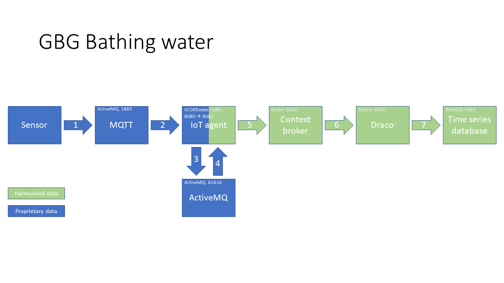
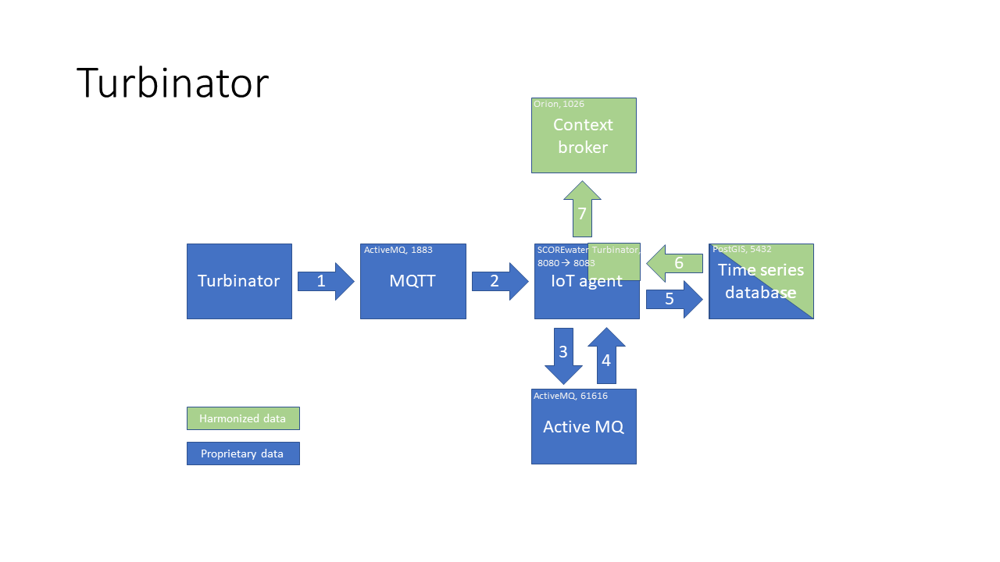

# SCOREwater minimum viable IoT agent

An IoT agents picks up proprietery data fron an IoT device (for example a sensor), converts these data to a commonly used standard datamodels and publishes the data using open APIs. Currently there are two examples which demonstrate different approaches. They are included in the Docker iamges. These show how to run both agents. 

## SCOREwater GBG bathing water temperature

The GBG bathing water temperature IoT subscribes to the MQTT queue of the City of Gothenburg. This queue publishes JSON data with bathing water tempertaure measurements. The IoT agent uses a queue to temporarily store the incomping data (in case there is an error further down the line) before starting the actual processing. The actual processing consists of parsing the incoming JSON data and creating WaterQualityObserved entities from these data. These WaterQualityObserved entities are published to the ContextBroker. Draco is subscribed to updates from the ContextBroker and stores the WaterQualityObserved entities in the time series database. 

## SCOREwater Turbinator

The Turbinator IoT agent uses a somewhat different approach with a similar result: the data are still being published using the ContextBroker and they end up in the time series database. The IoT agent subscribes to the Turbinator MQTT queue. This queue publishes JSON data with turbidity measurements. The IoT agent uses a queue to temporarily store the incomping data (in case there is an error further down the line) before starting the actual processing. The actual processing consists of parsing the incoming JSON data and storing them as is in the time series database. This database contains a view which allows us to select the raw data as standardized WaterQualityObserved entities. After storing the raw data in proprietary format, the IoT agent selects the WaterQualityObserved entity from the database and publishes it to the ContextBroker. This approach has the following advantages:

- Since data is stored "as is", we can always go back to the original data to adapt the harmonization (for instance fix an issue in a formula which might be used to convert raw to harmonized information);
- This approach allows you to publish the data from the time series database using different APIs, for example both a version 2 and a LD ContextBroker; 
- The raw information is not as "blown up" as the harmonized information. The view can easily incorporate static information which does not change between measurements (for instance a location or an address) which you would rather not duplicate for each measurement;
- Storing data in the time series database is not dependant on the proper functioning of the ContextBroker and Draco, reducing the risk of losing data should one of these unexpectedly be out of order. 

